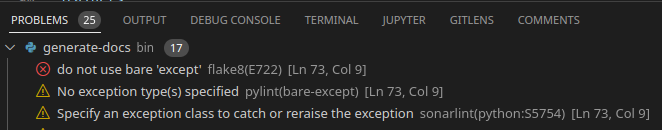

# Code
You can find the code [here](https://gitlab.sciling.com/medp/medp2).

# poetry
Poetry is the python package manager that we use. You can find a short tutorial [here](https://python-poetry.org/docs/basic-usage/).

# pre-commit hooks
[Pre-commit](https://pre-commit.com/) is a tool to run some checks on the code before the commit is pushed. For instance, it can check for leaked passwords and IPs. After you have cloned the [gitlab repo](https://gitlab.sciling.com/medp/medp2) you can run:
```bash
make pre-commit-install
```
It will run on every commit only with the files that have been modified. In case you need to bypass the verification, you can run:
```bash
git commit -a --no-verify
```

# VSCODE
If you are a vscode you will find it handy to configure your [Jira](https://marketplace.visualstudio.com/items?itemName=Atlassian.atlascode), [git](https://marketplace.visualstudio.com/items?itemName=eamodio.gitlens), [SonarLint](https://marketplace.visualstudio.com/items?itemName=SonarSource.sonarlint-vscode) and [pylance](https://marketplace.visualstudio.com/items?itemName=ms-python.vscode-pylance) modules to work with this project.

Also, you can enable linting in vscode for python files. To do so, press `CTRL+,` and search for `python linting enabled`.
There you can find all the linters that can be enabled. Pylint, flake8 and bandit are the most important to enable.

# Linters
Linters are typically configured with sane defaults. However, sometime you don't want/can't follow some rules.
You can disable linting errors that you are not interested in following.
Sometimes this can be dangerous because it can hidden a particular set of problems that could be identifies from static code,
so use it sparingly.

There are three ways of disabling linting errors:

## Globally
* pylint: https://gitlab.sciling.com/medp/medp2/-/blob/main/.pylintrc
* flake8: https://gitlab.sciling.com/medp/medp2/-/blob/main/.flake8
* sonarqube: https://sonarqube.sciling.com/profiles/show?language=py&name=Sonar+way

## Per block of code
You can disable specific linting errors by using comments. For instance, bare exceptions are not allowed by many linters:
```python
try:
    ...
except:  # NOSONAR python:S5754 # noqa: E722 # pylint: disable=bare-except # nosec B110
    pass
```
* Sonarqube: `# NOSONAR` optionally followed by a comma-separated list of specific issue codes.
* flake8: `# noqa:` optionally followed by a comma-separated list of specific issue codes
* pylint: `# pylint: disable=` optionally followed by a comma-separated list of specific issue codes
* bandit: `# nosec` optionally followed by a comma-separated list of specific issue codes
Note that for some linters spaces matter.

You can see the specific codes in the `PROBLEMS` section of the bottom panel.



## Per file

Usually, if you place the comment at the beginning of the file, the error is disabled for the whole file.


# Sonarqube
To execute the sonarqube pipeline:
```bash
make sonarqube
```
This will run the linters, static code analysis, unit tests, etc.
If you want to upload the results to the sonarqube server just run:
```bash
make push-sonarqube
```
You will need to export the credentials in the environment for this to work:
```
export SONARQUBE_URL=https://sonarqube.sciling.com SONARQUBE_TOKEN=XXXXXX
```

# Deploying manually
